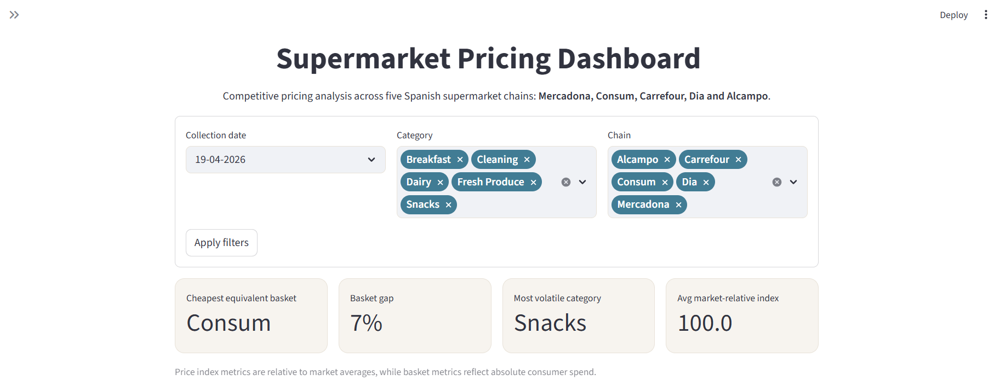

# Supermarket Pricing Dashboard

**An interactive competitive pricing analysis tool for the Spanish grocery market**, tracking price positioning, basket economics, and brand strategy across five major supermarket chains.

🔗 [Live dashboard](https://supermarket-pricing-dashboard.streamlit.app) &nbsp;|&nbsp; 📊 [Dataset](data/Dataset.xlsx) &nbsp;|&nbsp; 📄 [Executive Summary](docs/executive_summary.pdf)



---

## Overview

This project analyses how Mercadona, Consum, Carrefour, Dia, and Alcampo compete on price across five core product categories in the Spanish grocery market. It goes beyond simple price comparison: the tool introduces a product-normalised price index, equivalent basket cost using standardised reference quantities, and a cost-per-use metric for cleaning products — the kind of consumer-relevant framing that raw price data alone cannot provide.

The dashboard was built to answer three practical questions that matter to category managers, retail analysts, and strategy teams:
- Which chain is genuinely cheapest, and in which specific categories?
- How large is the private-label advantage, and where does it matter most?
- Are prices actually stable, or do short-term movements signal competitive activity?

---

## Problem statement

Spanish grocery retail is highly concentrated but locally differentiated. Mercadona holds a dominant national position, but regional chains like Consum (strong in Valencia) and hard discounters like Dia compete aggressively in specific categories. Understanding *where* each chain is cheaper — not just *whether* it is cheaper overall — requires category-level analysis that public price indices do not provide.

This dashboard operationalises that analysis for a comparable basket of 31 products across five categories, using two price snapshots to capture short-term pricing dynamics.

---

## Data

Data was collected **manually** from the official websites of all five chains across two time snapshots (19 April 2026 and 3 May 2026), resulting in 299 total observations.

| Dimension | Detail |
|---|---|
| Chains | Mercadona, Consum, Carrefour, Dia, Alcampo |
| Categories | Dairy, Breakfast, Cleaning, Fresh Produce, Snacks |
| Products | 31 SKUs tracked across chains |
| Snapshots | 2 (two-week interval) |
| Total observations | 299 |

### Dataset schema

Each observation includes: `product_id`, `product_name`, `package_size`, `brand`, `private_label`, `category`, `chain`, `price_eur`, `unit`, `price_per_unit`, `cost_per_use` (cleaning only), `comparability_flag`, `date`.

---

## Methodology

### Functional equivalence over exact matching
Identical SKUs are rarely available across five different chains. Products were selected based on functional equivalence within each category (e.g. mainstream chocolate cereals, not a specific brand), ensuring category-level comparability without forcing artificial matches. Products with structural differences that would distort comparison — a 150g premium cheese format vs. standard 200g, or a branded cereal where no private-label equivalent exists — were flagged as `not_comparable` and excluded from indexed analysis.

### Unit normalisation
All prices are standardised to `€/kg`, `€/L`, or `€/unit` to eliminate the distortions caused by different package sizes across chains.

### Product-normalised price index
Rather than averaging raw prices across categories (which would mix €/kg with €/unit), the price index computes each chain's price relative to the market average *for each individual product*, then aggregates those ratios. This produces a meaningful, unit-agnostic positioning score.

### Equivalent basket cost
Basket comparisons use standardised reference quantities (e.g. 500g of chicken breast, 1L of milk, 30 dishwasher tablets) applied to each chain's `price_per_unit`. This removes the distortion caused by chains selling different package sizes at different price points.

### Cost per use (cleaning products)
For cleaning products, the relevant consumer metric is cost per wash cycle, not cost per litre. Laundry liquid and dishwasher gel are normalised to `€/wash`; tablets and capsules use `€/unit` as the wash equivalent is already fixed.

### Temporal comparison
Identical product-chain pairs are compared between the two snapshots. Only products present in both snapshots are included in the stability analysis.

---

## Key findings

These findings are based on the most recent data snapshot (3 May 2026) using comparable, private-label products unless otherwise noted.

**1. Mercadona leads overall, but no chain dominates every category.**
Mercadona has the lowest product-normalised price index (96.4 vs. a market average of 100), followed closely by Consum (97.7). Carrefour sits at 105.0. However, Carrefour leads on breakfast pricing and Alcampo on fresh produce — meaning price leadership is category-specific rather than uniform.

**2. The private-label premium is real and largest where it matters most.**
Branded breakfast products cost approximately 18% more than private-label equivalents per unit. In snacks, the premium is 8%. The cleaning category shows the starkest contrast at the product level: switching from Fairy branded dishwasher tablets to Mercadona's Bosque Verde equivalent saves roughly 70% per wash cycle (€0.167 vs €0.098).

**3. The equivalent basket gap is smaller than perceived.**
Buying a standardised 31-product private-label basket at Consum (cheapest, €29.66) vs. Alcampo (most expensive, €31.78) saves €2.12 per trip — a 7.1% difference. The common perception that supermarket choice dramatically affects grocery spend is not well-supported by this data at the category level.

**4. Cleaning is the most contested category; breakfast is the most commoditised.**
Price dispersion across chains is highest in cleaning (σ = 25.4 index points) and lowest in breakfast (σ = 5.5). This suggests chains compete aggressively on cleaning — likely because private-label cleaning products are a key driver of value perception — while breakfast pricing is relatively aligned.

**5. Prices are highly stable in the short term, with targeted branded exceptions.**
88% of comparable product-chain pairs changed by less than 1% over the two-week window. The largest movements were concentrated in branded products: Consum reduced Dolce Gusto coffee capsules by 20.2% and Fairy dishwasher tablets by 20.0% between snapshots — consistent with a promotional repricing event rather than a structural strategy shift.

---

## Dashboard features

- **Global filters** — Date, category, and chain filters applied across all analysis sections via a single form submission
- **Executive summary** — Four key metrics (cheapest chain, basket gap, brand premium category, price stability) visible before any scrolling
- **Price index** — Product-normalised chain ranking with a 90–110 index range, highlighting the market average benchmark
- **Category heatmap** — Cross-tab of chain vs. category index values, colour-coded to show where each chain is cheap or expensive
- **Price dispersion** — Standard deviation of the price index by category, identifying competitive vs. commoditised segments
- **Category price leadership** — Which chain wins each category and how often
- **Equivalent basket cost** — Normalised 25-product private-label basket comparison using standardised quantities
- **Brand premium analysis** — Grouped bar chart of private-label vs. branded average prices by category
- **Cost per use** — Faceted chart of €/wash across four cleaning product types and five chains
- **Temporal dynamics** — Price stability metrics, category-level average change, and a detailed expander of individual price movements
- **Product deep dive** — Per-product explorer with price by chain, market positioning index, and price over time across both snapshots
- **Implication layer** — Each section ends with a strategic interpretation, not just a description of the chart

---

## Tech stack

| Layer | Tool |
|---|---|
| Data collection | Manual (Excel/Google Sheets) |
| Data processing | Python · Pandas · NumPy |
| Exploratory analysis | Jupyter Notebook |
| Dashboard | Streamlit |
| Visualisation | Plotly Express |
| Deployment | Streamlit Community Cloud |

---

## Repository structure

```
supermarket-pricing-dashboard/
│
├── data/
│   └── Dataset.xlsx          # Full dataset (both snapshots)
│
├── docs/
│   ├── executive_summary.pdf # One-page business brief
│   └── dashboard_preview.png
│
├── notebooks/
│   └── analysis.ipynb        # Exploratory analysis and price index methodology
│
├── app.py                    # Streamlit dashboard
├── requirements.txt
└── README.md
```

---

## Running locally

**Prerequisites:** Python 3.11+

```bash
# Clone the repository
git clone https://github.com/yourusername/supermarket-pricing-dashboard.git
cd supermarket-pricing-dashboard

# Install dependencies
pip install -r requirements.txt

# Run the dashboard
streamlit run app.py
```

The app expects the dataset at `data/Dataset.xlsx`. If you move the file, update the path in the `load_data()` function in `app.py`.

**Dependencies:**
```
streamlit
pandas
plotly
openpyxl
numpy
```

---

## Limitations and next steps

The current dataset is a manual two-snapshot collection, which limits temporal depth. The analysis reflects a specific regional market (Valencia) and may not generalise to national pricing, which varies by store format and location.

Planned extensions:
- Automated weekly price scraping to build a continuous time series
- Store-level price variation within chains
- Basket optimisation tool (cheapest chain for a user-defined product list)
- Category elasticity estimation as more snapshots accumulate

---

## About

Built by [Gabriela Rego Jamhour](https://gabrielajamhour.github.io) as part of a portfolio project combining data engineering, analytical methodology, and business strategy. Background in Computer Engineering + Business (ADE), with experience in 180DC consulting and full-stack development.

Data collected: April–May 2026 · Market: Spanish grocery retail (Valencia region)
